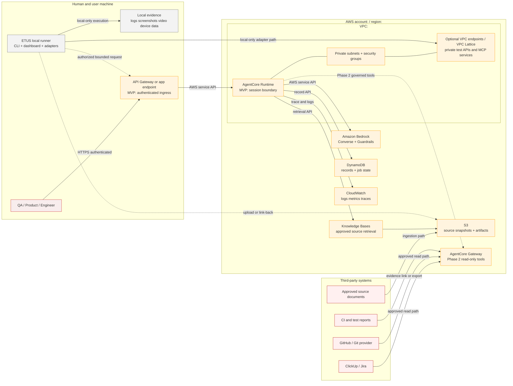
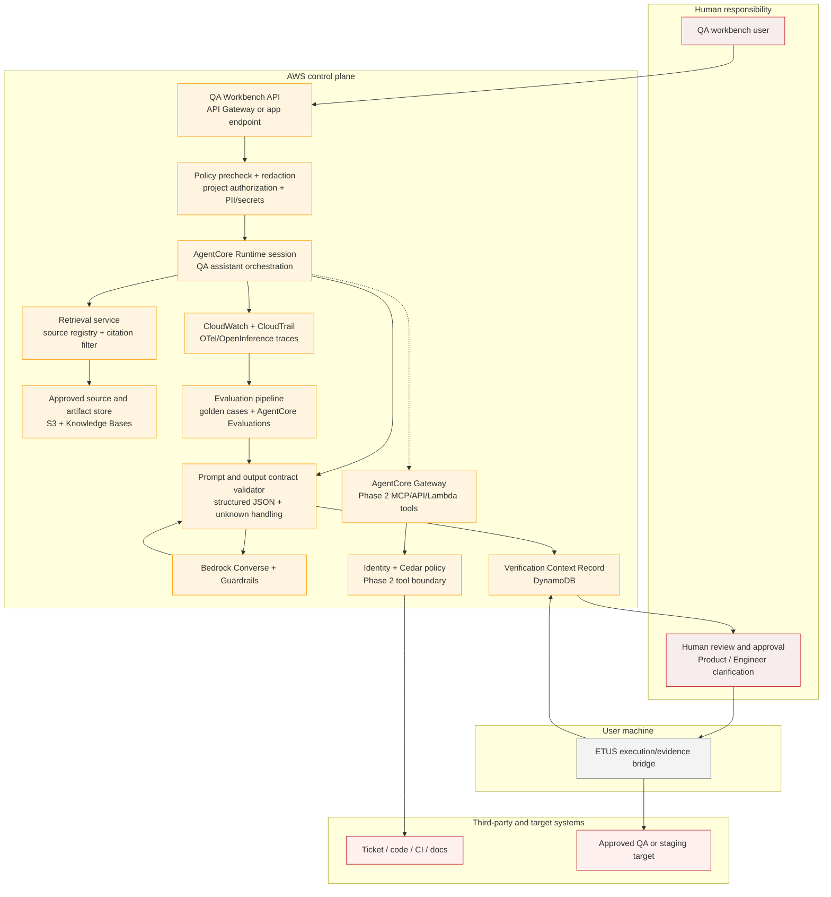
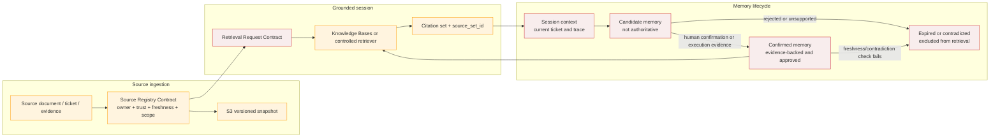
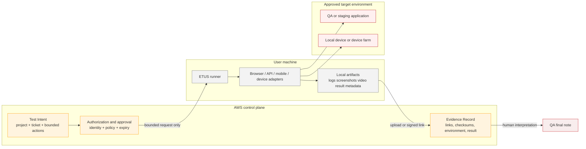
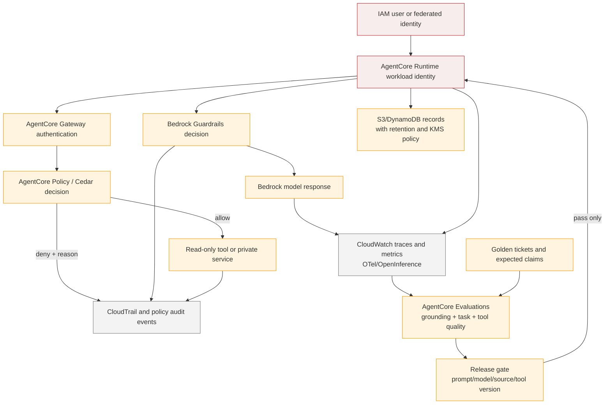

# QA-Agents AWS After-Proposal Architecture

Updated: 2026-07-23  
Status: Implementation architecture draft  
Source of truth: This Markdown file defines the post-proposal architecture. `qa-agents-aws-business-proposal.html` renders the same architecture for human review.

Related documents:

- [Business proposal draft](qa-agents-aws-business-proposal-draft-report.md)
- [Architecture design](qa-agents-aws-after-proposal-architecture-design.md)
- [RFC](rfc-qa-agents-ai-support.md)
- [AWS AI ecosystem stack guide](aws-ai-ecosystem-stack-guide.md)
- [AWS AI project stack map](aws-ai-project-stack-map.html)

## 1. Architecture Decision

Use a production-shaped hybrid architecture.

ETUS remains the local execution and evidence harness for browser, API, mobile and device-specific testing. AWS provides the governed control plane for intake, retrieval, model invocation, structured synthesis, durable records, identity, observability and evaluation.

The architecture is progressive:

- MVP: read-oriented QA assistant, approved source retrieval, Bedrock inference, Guardrails, structured records and human approval.
- Phase 2: AgentCore Runtime, Gateway, Identity, Policy, read-only third-party tools, managed Memory and private connectivity.
- Later: approved write-back, bounded execution orchestration and automated evaluation gates.

The ticket is an intent artifact, not the complete business truth. Every important claim must be labeled as source-backed, inferred or unknown.

## 2. Boundary Legend

| Boundary | Ownership | Examples | Allowed responsibility |
|---|---|---|---|
| Human | QA, Product, Engineer, Security | User workstation, approval UI | Decide business expectation, implementation interpretation, risk and sign-off |
| User machine | QA / automation owner | ETUS CLI, dashboard, browser/device adapters, local artifacts | Execute bounded tests and capture evidence; keep local-only device access local |
| AWS account and region | Cloud / platform owner | AgentCore, Bedrock, S3, DynamoDB, CloudWatch | Govern sessions, retrieval, model calls, state, traces and evaluation |
| AWS VPC | Cloud / network owner | Private subnets, security groups, VPC endpoints, VPC Lattice | Reach private test services without making them public |
| Third party | System owner | ClickUp, GitHub, CI, source docs, external device farm | Provide source or evidence through approved read-only boundaries |
| Target environment | Product / engineering owner | Staging, QA, sandbox, device target | System under test; never assume production access |

## 3. AWS Service Map

| Layer | Service or capability | Responsibility | Phase |
|---|---|---|---|
| Ingress | API Gateway or authenticated application endpoint | Accept ticket context and return a session/job reference | MVP |
| Runtime | Amazon Bedrock AgentCore Runtime | Host a production-shaped QA assistant session | MVP when service endpoint is introduced |
| Model | Amazon Bedrock Converse API | Generate structured verification context from grounded input | MVP |
| Safety | Amazon Bedrock Guardrails | Filter sensitive content and apply model input/output controls | MVP |
| Retrieval | Amazon Bedrock Knowledge Bases or controlled retrieval service | Search approved sources and return citations | MVP before broad pilot |
| Source store | Amazon S3 | Store source snapshots, exported artifacts and evaluation fixtures | MVP |
| Record store | Amazon DynamoDB | Store context records, job state, source metadata and idempotency keys | MVP |
| Async control | SQS, EventBridge or Step Functions | Run ingestion, evaluation and evidence workflows asynchronously | Later MVP / scale |
| Tool boundary | AgentCore Gateway | Expose governed MCP, API and Lambda tools | Phase 2 |
| Identity | IAM, AgentCore Identity and workload identity | Separate user, runtime and downstream credentials | MVP for protected integrations |
| Policy | AgentCore Policy with Cedar | Enforce tool and input-level allow/deny decisions | Phase 2 before tools |
| Memory | AgentCore Memory plus promotion rules | Store approved session and long-term QA knowledge | Phase 2 |
| Observability | CloudWatch, OpenTelemetry/OpenInference and CloudTrail | Trace calls, policy decisions, latency, failures and audit events | MVP |
| Evaluation | AgentCore Evaluations and golden dataset | Measure grounding, task completion, tool behavior and regressions | Before rollout changes |

## 4. AWS Deployment and Network Boundary

The target deployment is one AWS account and region for the MVP, with an explicit path to separate accounts or environments later. The Cloud team must replace placeholders such as `<aws-region>`, `<vpc-id>` and `<private-subnet-ids>` with approved environment values.



Network path rules:

- `ETUS -> local evidence` is local-only and must not require cloud availability to execute a local test.
- `User -> ingress` is authenticated HTTPS and must carry `project_id`, `actor_id`, `ticket_id` and `schema_version`.
- `Runtime -> Bedrock`, `Runtime -> Knowledge Bases`, `Runtime -> S3`, `Runtime -> DynamoDB` and `Runtime -> CloudWatch` are AWS service paths controlled by IAM.
- `Runtime -> private services` is optional and must use approved VPC connectivity, private subnets and least-privilege security groups.
- Third-party write-back is not part of MVP. Phase 2 tools are read-only until approval, audit and rollback are implemented.

## 5. Component and Container Boundary



Owner mapping:

| Container | Primary owner | Required behavior |
|---|---|---|
| API and precheck | Software + Security | Authenticate, authorize project, redact or reject sensitive data, create idempotent session |
| Runtime and orchestration | AI + Software | Call tools only through approved boundaries and preserve trace context |
| Retrieval and source registry | AI + QA | Retrieve only approved, fresh, project-scoped sources and return citations |
| Prompt/output validator | AI + QA | Enforce schema, distinguish inference from source-backed claims and reject unsupported output |
| Record/evidence store | Software + QA | Persist replayable context and evidence links with retention metadata |
| ETUS bridge | QA automation + Software | Send bounded intent and return evidence; never transfer unrestricted local authority |
| Gateway and policy | Cloud + Security | Authenticate and authorize every tool invocation; log allow/deny decisions |
| Observability/evaluation | Cloud + AI + QA Lead | Capture traces and enforce quality gates before prompt/model/source changes |

## 6. Ticket-to-Final-QA-Note Flow

```mermaid
sequenceDiagram
  autonumber
  actor QA as QA user
  participant API as API ingress
  participant PRE as Precheck
  participant RT as AgentCore Runtime
  participant KB as Knowledge Base
  participant BR as Bedrock Converse + Guardrails
  participant REC as Record store
  participant ETUS as ETUS local runner
  participant TARGET as QA/staging target
  participant OBS as CloudWatch / evaluation

  QA->>API: Submit Ticket Intake Contract
  API->>PRE: Authenticate, authorize project, redact secrets
  alt rejected input
    PRE-->>QA: Block with actionable reason
  else accepted input
    PRE->>RT: Start session with trace_id
    RT->>KB: Retrieve approved sources with source_set_id
    alt no approved source
      KB-->>RT: Missing context
      RT-->>QA: Clarification required; no test plan
    else sources found
      KB-->>RT: Chunks and citations
      RT->>BR: Grounded prompt + guardrail config
      alt guardrail blocks
        BR-->>RT: Blocked content and trace
        RT-->>QA: Redact or correct input
      else model response
        BR-->>RT: Structured Verification Context Record
        RT->>REC: Validate schema, claims and citations
        alt unsupported claim or contradiction
          REC-->>QA: Mark unknown or clarification required
        else ready for review
          REC-->>QA: Draft record with risks and evidence checklist
          QA->>REC: Approve or request Product/Engineer clarification
          QA->>ETUS: Run bounded test intent
          ETUS->>TARGET: Execute manual or automated test
          TARGET-->>ETUS: Result and artifacts
          ETUS->>REC: Attach Evidence Record
          QA->>REC: Approve final QA note
          REC->>OBS: Trace, metrics, evaluation sample
        end
      end
    end
  end
```

Required failure behavior:

- Missing approved source: stop synthesis and create a clarification request.
- Unsupported claim: label as unknown, do not convert it to expected behavior.
- Conflicting sources: preserve both citations and route conflict to the source owner.
- Denied tool action: return a policy decision, never retry with a different credential or bypass path.
- Incomplete evidence: keep the record in `needs_evidence`; do not draft a release approval.
- Runtime or model failure: preserve the session and trace id, allow safe retry with idempotency.

## 7. Knowledge Base and Memory Lifecycle



Memory rules:

- Model output alone never promotes memory.
- Each memory entry needs scope, evidence, trust, confirmation state, freshness and contradiction status.
- Business rule memory requires Product or Business owner confirmation.
- Implementation memory requires Engineer or Tech Lead confirmation.
- Execution memory requires an Evidence Record with environment, run id and timestamp.
- Expired or contradicted memory remains auditable but is excluded from default retrieval.

## 8. ETUS Execution and Evidence Flow



ETUS must receive a bounded request containing the allowed test intent, target environment, expiry and trace id. It must not receive unrestricted AWS credentials or an unrestricted instruction to browse, shell or write to third-party systems.

## 9. Security, Observability and Evaluation Flow



Security requirements:

- Separate human, Runtime and downstream tool roles.
- Store secrets in Secrets Manager or an approved identity exchange path, never in prompts or artifacts.
- Apply resource-based and identity-based policies together where supported.
- Use private connectivity for internal services and databases.
- Apply least-privilege security groups to AgentCore VPC connectivity.
- Keep third-party integrations read-only until approval, audit and rollback exist.
- Record model, prompt, guardrail, source set, policy decision and approval versions for replay.
- Treat CloudWatch logs, traces, artifacts and tickets as potentially sensitive data with retention controls.

## 10. Cross-Boundary Contracts

| Contract | Required fields | Owner |
|---|---|---|
| Ticket Intake Contract | `project_id`, `ticket_id`, intent, acceptance criteria, environment, actor, links, risk | QA + Product |
| Source Registry Contract | `source_id`, type, owner, trust, freshness, scope, citation path, expiry | QA + AI |
| Retrieval and Citation Contract | query intent, source filters, `source_set_id`, citations, conflicts, missing-context result | AI |
| Verification Context Record | business intent, current behavior, impacted flows, risk, test matrix, unknowns, citations | QA + AI |
| Evidence Record | evidence id, run id, type, environment, timestamp, path/link, checksum, result, owner | QA automation |
| Memory Entry | scope, statement, evidence, trust, confirmation, contradiction, expiry, last confirmed | QA + Product/Engineer |
| Tool Invocation and Approval | tool, mode, actor, input, policy decision, approval, expiry, audit id, rollback path | Cloud + Security |
| Evaluation Case and Result | input, expected claims, required citations, blocked actions, score, evaluator version | AI + QA Lead |

Cross-boundary records should carry `session_id`, `trace_id`, `source_set_id`, `created_at`, `actor_id` and `schema_version` where applicable.

## 11. MVP and Enhancement Gates

| Layer | Capability | Gate before enabling |
|---|---|---|
| MVP | Read-oriented synthesis with structured output | Schema validation, citations, human review and no auto-write |
| MVP | Approved source retrieval | Source owner, trust level, freshness and project scope |
| MVP | Bedrock Guardrails | PII/secrets policy and blocked-content handling |
| MVP | Durable records and traces | Replay fields, retention and access policy |
| Phase 2 | AgentCore Gateway read-only tools | Identity, tool schema, Cedar policy, audit and timeout |
| Phase 2 | AgentCore Memory | Promotion, contradiction, expiry and retrieval tests |
| Phase 2 | Private VPC access | Approved subnets, security groups, endpoints and test target classification |
| Later | Draft or approved write-back | Human approval, idempotency, audit and rollback |
| Later | Semi-automated execution | Bounded actions, sandbox target, evidence completeness and release gate |

## 12. Acceptance Criteria

- Cloud can identify account, region, VPC, subnet, security group, endpoint and service boundary from the deployment diagram.
- QA can follow ticket-to-evidence flow and see every human approval point.
- AI engineering can identify retrieval, prompt, output validation, Guardrails and evaluation boundaries.
- Software engineering can identify contracts and durable records required for implementation.
- Security can identify identity, secret, private-network, policy and audit controls.
- Every diagram labels MVP and Phase 2 capability.
- HTML diagrams are readable on desktop and horizontally scrollable on narrow screens.
- No diagram implies autonomous release approval or unrestricted production access.

## 13. Research Basis

- [Amazon Bedrock AgentCore overview](https://docs.aws.amazon.com/bedrock-agentcore/latest/devguide/)
- [AgentCore Gateway](https://docs.aws.amazon.com/bedrock-agentcore/latest/devguide/gateway.html)
- [AgentCore Policy and Cedar](https://docs.aws.amazon.com/bedrock-agentcore/latest/devguide/policy.html)
- [AgentCore VPC connectivity](https://docs.aws.amazon.com/bedrock-agentcore/latest/devguide/agentcore-vpc.html)
- [Private connectivity with VPC Lattice](https://docs.aws.amazon.com/bedrock-agentcore/latest/devguide/vpc-egress-private-endpoints.html)
- [AgentCore resource-based policies](https://docs.aws.amazon.com/bedrock-agentcore/latest/devguide/resource-based-policies.html)
- [AgentCore observability](https://docs.aws.amazon.com/bedrock-agentcore/latest/devguide/observability-configure.html)
- [Bedrock Guardrails with Converse](https://docs.aws.amazon.com/bedrock/latest/userguide/guardrails-use-converse-api.html)
- [AWS Architecture Icons](https://aws.amazon.com/architecture/icons/)
