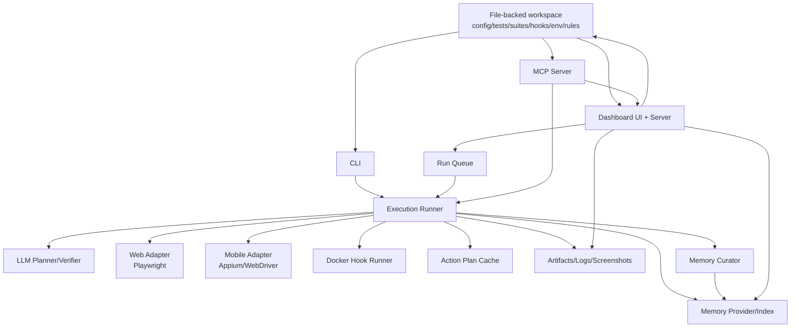
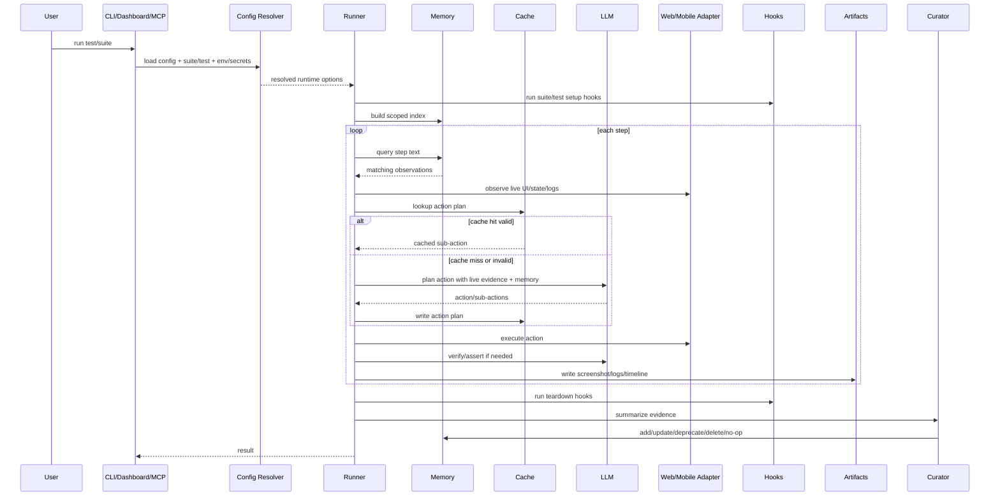

# Deep Scan: agent-qa by Vostride

Ngay lap tuc can luu y: agent-qa khong phai MIT/Apache ngay tu dau. Repo dang dung Functional Source License 1.1 voi "ALv2 Future License". Theo license cong khai, ban duoc dung/sua/redistribute cho cac muc dich duoc phep, nhung "Competing Use" bi loai tru; moi version chi chuyen sang Apache 2.0 sau nam thu hai ke tu ngay version do duoc phat hanh. Neu muc tieu la "bien ung dung nay thanh cua minh" de ban nhu mot san pham canh tranh, can xu ly license truoc: xin commercial license, chi dung noi bo, cho den khi version can dung da chuyen Apache, hoac rebuild clean-room dua tren y tuong/chuc nang thay vi copy code.

Tai lieu nay duoc tong hop tu docs chinh thuc, GitHub repo, npm/unpkg metadata va source-map snippets cong khai. Shell trong moi truong hien tai khong resolve duoc `github.com`, nen toi khong clone duoc repo; phan code-level la scan qua web sources, khong phai local checkout.

## 1. Tong Quan San Pham

agent-qa la mot agentic QA harness cho web va mobile. San pham cho phep viet test bang ngon ngu tu nhien, chay bang LLM tu chon, ghi lai artifacts, tu "heal" khi UI drift, va tich luy memory tu cac lan chay de cac lan sau biet nhieu hon ve product.

Positioning cua ho:

- "Self-improving Agentic QA harness with Memory".
- Test, config, suite, hook, memory, cache va artifacts deu file-backed, co the review nhu code.
- Khong khoa nguoi dung vao vendor storage/model; nguoi dung bring-your-own LLM.
- Phu hop voi developer/team QA muon automated E2E nhung khong muon fragile selector scripts.
- Co hai nhom interface: human-facing dashboard/CLI va agent-facing MCP/skills.

Phan doc marketing nhan manh ba diem kinh doanh:

- Giam chi phi tao va bao tri E2E tests bang natural language.
- Giam flaky maintenance bang self-healing va cache.
- Bien QA thanh mot tai san trong repo: diff, review, CI, agent co the tu viet/chay/triage test.

## 2. Khach Hang Va Use Case

Nguoi dung muc tieu:

- Software teams can regression gates truoc release.
- Developer muon agent coding tu verify thay doi cua no.
- QA engineer muon viet flows o muc intent thay vi selector.
- Team co nhieu app web/native va can reuse cung mot testing mental model.
- Team muon tu kiem soat LLM provider, auth, artifacts va memory.

Use case chinh:

- Smoke/regression tests bang YAML tu nhien.
- Run local, CI, release gate, post-deploy check.
- Dashboard debug: xem screenshot, reasoning, console/network, ARIA tree, accessibility, timeline.
- Suite workflow: gom nhieu test thanh release smoke / multi-step regression.
- Hook setup/teardown: seed data, call API, verify side effects, cleanup, export variables.
- Auth reuse: capture login state mot lan, chay nhieu test authenticated.
- Mobile app testing tren Android/iOS local hoac BrowserStack.
- AI agent authoring: agent qua MCP co the doc config, tao/sua test/suite/hook, enqueue run, doc artifacts, classify failure.

## 3. Tinh Nang Chinh

### 3.1 Natural-Language Tests

Test YAML toi thieu gom:

- `test-id`: stable canonical id, sinh bang dashboard hoac CLI.
- `name`: ten human-readable.
- `target`: target trong `registry.targets`.
- `steps`: danh sach lenh ngon ngu tu nhien.

Mo rong co:

- `context`: product/environment assumptions cho agent.
- `setup`/`teardown`: hook IDs.
- `use`: override browser, timeout, cache, memory, device, auth state.
- step object: timeout, retries, screenshot, maxAttempts, capture.
- capture runtime variables: `regex`, `selector`, `ai`, sau do dung `{{env:NAME}}`.

### 3.2 Web Testing

Web target dung `platform: web` va `url`. Browser duoc quan ly qua Playwright-managed Chromium/Firefox/WebKit. Config ho tro:

- `browser.name`: `chromium`, `firefox`, `webkit`.
- `browser.headless`.
- `browser.viewport`.
- `timeout.navigation`, `timeout.step`, `timeout.test`.
- `logCapture.console`, `logCapture.network`.
- CLI override cho one-off/debug/matrix: `--browser`, `--headless`, `--no-headless`.

### 3.3 Mobile Testing

Mobile target dung `platform: android` hoac `ios`.

Android:

- `appPackage`.
- `appActivity`.
- optional `app.path` local APK hoac `app.browserstack`.

iOS:

- `bundleId`.
- optional `.app` path hoac BrowserStack app id.

Device profile:

- `transport: local` dung Appium va local emulator/simulator/device.
- `transport: browserstack` dung BrowserStack capabilities.

Mobile run bat buoc khai bao `use.mobile.appState` la `preserve` hoac `reset`. Native mobile khong dung `use.authState`; neu can giu login thi dung app state preservation hoac app-specific test support.

### 3.4 Suites

Suite gom nhieu test files theo thu tu, dung cho release gates/smoke/multi-step workflows.

Fields:

- `suite-id`.
- `name`.
- `target`.
- `context`.
- `setup`, `teardown`.
- `use`.
- `tests`: moi item co `test` path va expected `id`.

Runner load file, parse test, so sanh `test-id` voi suite entry. Mismatch fail truoc khi chay. Test trong suite chay theo thu tu; neu mot child fail thi child sau bi skip. Suite-level `target` va `use` lam shared defaults; test-level override duoc deep merge.

### 3.5 Hooks

Hooks la project scripts chay trong Docker sandbox. Dung de:

- seed data.
- call API.
- verify side effect.
- cleanup.
- export runtime variables.
- doc active auth state cho authenticated web run.

Hook registry thuong la `hooks.yaml`, moi hook co:

- `id`.
- `name`.
- `runtime`: `node`, `bun`, `python`, `bash`.
- `file`.
- `timeout`.
- `network`.
- optional `deps`, `packageFile`.

Output contract: hook viet dotenv vao `/tmp/agent-qa.env`, agent-qa merge vao run variables. Inline hook dung syntax `{{runHook:"hook-id"}}`.

Sandbox boundary:

- Docker image rieng cho tung runtime.
- Hook files copy vao temp workspace, mount vao `/workspace`.
- Container filesystem read-only.
- `/tmp` writable.
- Resource limits: memory, CPU, pid.
- Secrets bi redact trong stdout/stderr/errors theo best effort.
- `network: false` chay container voi `--network none`.

### 3.6 Auth State

Auth state la Playwright-compatible storage state cho web login.

Workflow:

- Capture qua Dashboard Live Mode hoac CLI `agent-qa auth-state capture --target ... --name ...`.
- Save theo target + logical name.
- Test/suite dung `use.authState: qa-admin`.
- Test khong tham chieu file path truc tiep.
- V1 moi run chi dung mot primary auth state.
- State gom cookies, localStorage, IndexedDB; SessionStorage khong nam trong V1 contract.

Security:

- Auth state la credential material; can gitignore.
- Hooks chi nhan active selected state qua env vars.
- Raw cookies/localStorage/storage paths bi exclude khoi artifacts, dashboard run APIs, MCP run tools, logs, errors, analytics.
- Capture/replacement can explicit action.

### 3.7 Self-Healing

Self-healing duoc mo ta la khi sub-action nhu click/fill/select fail, agent-qa re-observe UI va thu path khac trong cung run. He thong khong fail ngay khi selector/interaction cu khong con dung. Config lien quan:

- `use.healing.maxAttempts`.
- Planner max sub-actions.
- Cache invalidation khi cached action fail can replan.

### 3.8 Cache

Cache la execution-level reuse, khong phai memory. No luu action plans cho step sub-actions.

Default:

- `.agent-qa/cache`.
- TTL config trong `services.cache.ttl`.
- Per-run/test/suite toggle `use.cache`.
- CLI `--no-cache`.

Cache key dung step hash tu:

- config file content.
- suite file content.
- suite test index.
- test file content.
- step instruction.
- platform.
- step index.

Cache miss khi:

- file missing/invalid JSON.
- schema version mismatch.
- TTL expired.
- miss tai sub-action N thi invalidate tu N tro di.
- cached action fail va can replan.
- old secret redaction marker khong con phu hop runtime secret template.

San pham claim intended impact trong docs: repeated similar runs co the nhanh hon dang ke va dung it planner tokens hon, nhung run van observe live page va verify outcomes.

### 3.9 Memory

Memory la flagship differentiator. No luu behavioral observations ve product/suite/test duoi dang markdown files, mac dinh `agent-qa-memory`.

Tiers:

- `products/<product>/`.
- `suites/<suiteId>/`.
- `tests/<testId>/`.

Lifecycle:

1. Run co product, test id, optional suite id + suite position.
2. Runtime build in-memory index tu observations phu hop.
3. Moi step sanitize step text thanh query.
4. Matching observations inject vao `<memory-context>`.
5. Agent van observe live app va execute step.
6. Sau run, curator quyet dinh add/update/deprecate/delete/do nothing.

Important boundary: memory la contextual evidence, khong phai command channel. Live observation/test instruction/logs van uu tien.

Runtime injection:

- Scoped theo product/test/suite.
- Suite observations chi include neu suite snapshot match current entries va position match current child position.
- Local provider search full-text, filter by `minTrust`, order theo rank adjusted by trust, limit `maxInjections`.
- Query fail/no result la non-fatal.

Reliability controls trong schema/source-map snippets:

- `minTrust`.
- `maxInjections`.
- `curatorEnabled`.
- `curatorLockTimeout`.
- `trustConfirmDelta`.
- `trustContradictDelta`.
- `ablationEnabled`.
- `circuitBreakerEnabled`.
- `circuitBreakerWindowSize`.
- `circuitBreakerBaselineSize`.
- `circuitBreakerThreshold`.
- scanObservationText de block unsafe memory text.
- path traversal guard khi delete observation.
- duplicate search bang SQLite FTS5 va fallback similarity.

### 3.10 Dashboard

Dashboard la local web UI cho:

- Inspect runs.
- Author/edit tests, hooks, suites.
- Review memory.
- Manage config.
- Follow live runs.
- Queue-aware workflows.

Launch:

- `agent-qa dashboard --port 3470 --open`.
- `--db <path>` cho dashboard SQLite.
- `serve` start dashboard-backed services tu config.

Routes/surfaces:

- `/runs`: run list, filters, queue slots, statuses, targets, duration.
- `/runs/:id`: run detail.
- `/runs/:id/live`: live execution.
- `/tests`, `/tests/new`, `/test/:testId`, `/test/:testId/edit`, live edit query.
- `/hooks`, `/hooks/new`, `/hook/:hookId`, `/hook/:hookId/edit`.
- `/suites`, `/suites/new`, `/suite/:suiteId`, `/suite/:suiteId/edit`.
- `/memory`, `/memory/:product`.
- `/insights`: pass rate, duration, token usage, curator/memory charts.
- `/config`, with bucket/item query links.

Run detail includes:

- Step timeline.
- Captured browser/mobile state.
- Tabs: Overview, Variables, Network, Console, ARIA Tree, A11y.
- Per-action timing.
- Model usage metadata.
- Live progress/cancel/current step/verifier/action feedback.

### 3.11 CLI

CLI la local control plane:

Setup:

- `init`.
- `install-browsers`.
- `install-mobile-drivers`.
- `doctor`.

Run/inspect:

- `run [patterns...]`.
- `dashboard`.
- `serve`.
- `queue list`.
- `queue cancel`.

Author/validate:

- `validate`.
- `create-test`.
- `create-suite`.
- `ids generate`.
- `ids validate`.

Config/auth:

- `config set`.
- `config show`.
- `auth login`.
- `auth set`.
- `auth status`.
- `auth logout`.
- `auth-state capture`.
- `auth test`.
- `devices list`.
- `devices init`.

Maintenance:

- `cache purge`.
- `clean-memory`.

AI-native:

- `mcp`.
- `skills`.

Important run flags:

- `--browser`.
- `--platform`.
- `--headless` / `--no-headless`.
- `--no-cache`.
- `--no-memory`.
- `--bail`.
- `--dry-run`.
- `--list-tests`.
- `--junit-output`.
- `--screenshot-dir`.
- `--screenshot-mode`.
- `--reporter`.
- `--record`.
- `--config-debug`.
- `--test`.
- `--suite`.
- `--all`.
- `--device`.
- `--var`.
- `--run-attr`.

### 3.12 MCP Va Skills

MCP expose source-backed tools cho AI coding agents.

Transports:

- Dashboard-backed HTTP endpoint: mac dinh `http://127.0.0.1:3471/mcp`.
- Stdio: `agent-qa mcp`, client phai pass `dashboardUrl` cho dashboard-backed tools.

Tool groups:

- Discovery/config/schema/ids: `agent_qa_discover`, `agent_qa_get_config`, `agent_qa_schema_reference`, `agent_qa_validate_definition`, `agent_qa_generate_id`, `agent_qa_validate_id`.
- Tests: list/read/validate/create/update/delete.
- Suites: list/read/validate/create/update/delete.
- Hooks: list/read/create/update/delete/run.
- Run/triage: enqueue test/suite run, get run, steps, logs, execution logs, artifacts, cancel run, classify failure.

Security note: MCP endpoint la workspace access. De loopback; can review auto-approval cua agent client truoc khi enable mutation tools.

## 4. File-Backed Model

Core project file map:

```text
agent-qa.config.yaml       # global workspace, services, registry, plugins, defaults
agent-qa.local.yaml        # local devices/apps/providers; gitignored
agent-rules.md             # project-specific agent instructions
hooks.yaml                 # hook registry
scripts/*                  # hook implementations
tests/**/*.yaml            # natural-language tests
suites/**/*.suite.yaml     # ordered suites
.env                       # non-secret variables
.env.secrets.local         # secrets
~/.agent-qa/auth.json      # saved LLM credentials outside project
.agent-qa/artifacts        # run artifacts
.agent-qa/cache            # cached action plans
.agent-qa/auth-states      # browser auth states
agent-qa-memory            # memory observations
```

Config precedence:

```text
global config -> suite use -> test use -> CLI flags
```

Source says dashboard and CLI both read/write same file-backed definitions. That is central to product design: UI is authoring convenience, files are source of truth.

## 5. Software Architecture

### 5.1 Repo/Package Layout

GitHub repo root is pnpm/turbo monorepo, Node >=24, TypeScript-heavy. Package list from GitHub:

```text
packages/
  android
  cli
  core
  dashboard-server
  dashboard-ui
  ids
  ios
  mcp
  web
demo-project/
docker/
docs/assets/
scripts/
skills/
```

Root package facts:

- `name`: `agent-qa-monorepo`.
- `private`: true.
- `type`: module.
- package manager: `pnpm@10.6.1`.
- build system: `turbo`.
- scripts: build/test/typecheck/lint/dev/clean, validation scripts, release scripts.
- dev deps: TypeScript 6, Vitest, Turbo, semver.
- overrides pin Hono, @hono/node-server, basic-ftp, brace-expansion, lodash, path-to-regexp, webdriver/undici, etc.

Published package facts from `@vostride/agent-qa-core`:

- Version seen: `0.1.21`.
- Description: core runtime, schemas, tools, execution services.
- Dependencies include AI SDK providers, `better-sqlite3`, `yaml`, `zod`, `sharp`, `posthog-node`, `glob`, `ms`, `bytes`, `fast-xml-parser`, `id-agent`.
- Build via `tsup`.
- Exports ESM/CJS/types.

Published dashboard package observed on unpkg:

- `@vostride/agent-qa-dashboard`.
- Description: local dashboard server, APIs, run queue, artifact services.
- Contains built `dist` around 4 MB plus license/notice/package.

### 5.2 Logical Components



### 5.3 Runtime Flow



### 5.4 Important Engineering Decisions

- File-backed definitions first, UI/API second.
- Runtime evidence first, memory second.
- Cache skips planning only; it is not replay.
- Hooks isolated via Docker to keep product setup/verifications out of runner process.
- MCP mutation tools prefer dashboard workspace-safe APIs.
- Auth state file contents are intentionally not exposed through artifacts/APIs.
- Local MCP host schema restricts to loopback.
- Mobile requires explicit app state to avoid ambiguous destructive/non-destructive behavior.
- Product memory scope can be set by target `product`; schema blocks path traversal characters.

## 6. Data And Storage

### 6.1 Dashboard DB

Dashboard supports `--db <path>` and config `services.dashboard.dbPath`. Docs imply SQLite-backed dashboard state. Exact schema was not extracted in this scan.

### 6.2 Artifacts

Artifacts directory default from sample config:

```yaml
services:
  dashboard:
    artifactsDir: .agent-qa/artifacts
```

Artifacts include run timeline, screenshots, variables, network, console, ARIA tree, accessibility, timing, model usage metadata, logs and execution logs.

### 6.3 Memory Store

Memory is markdown observation files plus local index. Source-map snippets show local provider using `better-sqlite3` FTS5 in memory for duplicate search and presumably search/indexing. Observations are parsed, security-scanned, filtered by trust, and protected against path escapes.

### 6.4 Cache Store

Cache files:

```text
.agent-qa/cache/<stepHash>/sub-<index>.json
```

Cache key intentionally changes when test/config/suite/platform/step position changes.

### 6.5 Auth/Credentials

- LLM credentials: `~/.agent-qa/auth.json`.
- Web auth state: `.agent-qa/auth-states`, target/name scoped.
- Secrets: `.env.secrets.local`.
- Non-secrets: `.env`.

## 7. Security Model

Strong points:

- Secrets kept out of test context; docs warn not to put credentials in prompts.
- Auth state not exposed through dashboard/MCP run APIs.
- Hook output redaction.
- Docker hook isolation with read-only FS and resource limits.
- MCP host restricted to loopback in local config schema.
- Provider headers validation rejects auth-like header names in config snippets.
- Target product path sanitization.
- Memory write security scan and path traversal guard.
- `agent-qa.local.yaml`, auth states, env secrets are meant to be gitignored.

Risks/open questions:

- Redaction is best effort; app tokens may not match known secrets.
- MCP mutation endpoints are powerful; bad auto-approval can mutate tests/suites/hooks and enqueue runs.
- Hook sandbox still executes project code; Docker availability and image trust matter.
- Memory poisoning is possible in concept; mitigations exist, but details need code audit.
- Dashboard local server exposure should remain loopback; no shared deployment model is documented.
- Auth state expiry is not detected automatically; first product step should validate session.
- Source license is not permissive for commercial competing use today.

## 8. Business Moat

The differentiators are not just "LLM drives browser":

- File-backed QA assets that teams review like code.
- Memory layer with product/suite/test tiers.
- Curator after each run.
- Cache layer keyed to source/config context.
- Dashboard that exposes reasoning and artifacts.
- MCP tools that let coding agents author/run/triage tests.
- Hook sandbox so QA can interact with product APIs/data safely.
- Web + mobile in one mental model.

This is closer to a QA operating system for agent-era teams than a simple Playwright wrapper.

## 9. Competitive Surface

Docs explicitly compare against many tools: Momentic, QA Wolf, Tricentis, LambdaTest, mabl, Katalon, Functionize, Applitools, testRigor, Rainforest QA, Autify, ACCELQ, MagicPod, Octomind, Playwright, Cypress, Selenium, Appium, Maestro, etc.

Their positioning against classic frameworks:

- Playwright/Cypress/Selenium/Appium are powerful but require imperative scripts/selectors.
- agent-qa tries to move tests to intent + runtime adaptation + memory.

Their positioning against AI QA vendors:

- Open-source/repo-owned.
- Bring-your-own LLM.
- Local artifacts/memory/config.
- Agent/MCP-native.

## 10. Neu Muon Bien Thanh San Pham Cua Ban

### 10.1 Duong Ngan Han: Dung Noi Bo

An toan nhat ve license:

- Cai `agent-qa` nhu dev dependency trong repo cua ban.
- Tao test/suite/hook/memory rieng cho product cua ban.
- Branding noi bo khong phai product canh tranh.
- Khong redistribute nhu mot commercial replacement.

### 10.2 Duong Fork/Commercial

Neu muon fork va ban/host:

- Doc license voi legal counsel.
- Lien he tac gia de xin commercial license hoac permission.
- Neu fork, giu license notice/copyright.
- Can audit toan bo dependencies va third-party notices.
- Can xac dinh version nao da/chu chuyen Apache sau 2 nam.

### 10.3 Duong Clean-Room Rebuild

Neu muon lam "cua minh" ma tranh copy:

- Dung docs cong khai de xac dinh product requirements, khong copy source.
- Viet spec rieng.
- Team A doc/phan tich behavior; team B implement tu spec.
- Dat ten/ID/schema/routing khac de tranh trademark/trade dress confusion.
- Rebuild components:
  - YAML schema + config resolver.
  - Web runner bang Playwright.
  - Mobile runner bang Appium/WebDriverIO.
  - LLM planner/verifier abstraction.
  - Artifact/log timeline.
  - Dashboard.
  - Memory provider + curator.
  - Cache provider.
  - Docker hook runner.
  - MCP server.

### 10.4 MVP Ban Nen Lam

MVP hop ly neu build san pham rieng:

1. Web-only runner: Playwright + natural-language steps + OpenAI-compatible LLM.
2. File-backed config/tests/suites.
3. Artifacts: screenshot, console, network, step timeline.
4. Dashboard run viewer + test editor.
5. Hooks Node/Bash only, Docker sandbox optional phase 2.
6. Basic cache keyed by config/test/step/platform.
7. Memory V1: markdown observations + simple FTS search + manual review before injection.
8. MCP V1: discover/config/list/read/create/update/run/get-artifact.
9. Auth state capture for web.
10. CI reporter: console + JUnit.

Defer:

- Mobile.
- BrowserStack.
- Sophisticated curator.
- Ablation/circuit breaker.
- Multi-provider subscription auth.
- Complex accessibility panel.
- Polished insights dashboard.

## 11. Implementation Blueprint Neu Rebuild

### 11.1 Suggested Stack

- Runtime: Node 24+, TypeScript.
- CLI: Commander/Clipanion.
- Web automation: Playwright.
- Mobile: Appium/WebDriverIO.
- Server: Hono/Fastify.
- Dashboard: React + TanStack Query + Monaco/YAML editor.
- DB: SQLite + better-sqlite3.
- Schema: Zod + YAML parser.
- LLM: Vercel AI SDK or provider-specific adapters.
- Artifacts: file store with JSON event log, screenshots, traces.
- MCP: official MCP SDK.
- Hooks: Docker CLI wrapper or container runtime abstraction.

### 11.2 Core Modules

```text
packages/
  core/
    config/
    schema/
    runner/
    planner/
    verifier/
    artifacts/
    memory/
    cache/
    hooks/
    auth-state/
    reporters/
  web/
    playwright-adapter/
  mobile/
    appium-adapter/
  dashboard-server/
    api/
    queue/
    workspace-files/
  dashboard-ui/
  cli/
  mcp/
  ids/
```

### 11.3 Run Artifact Shape

```json
{
  "runId": "r_...",
  "status": "passed|failed|running|cancelled",
  "target": "app-web",
  "platform": "web",
  "startedAt": "...",
  "finishedAt": "...",
  "steps": [
    {
      "index": 0,
      "instruction": "Open the dashboard",
      "status": "passed",
      "attempts": [
        {
          "observation": "...",
          "memoryIds": [],
          "cache": "hit|miss|partial",
          "actions": [],
          "verification": {}
        }
      ]
    }
  ]
}
```

### 11.4 Planner Contract

Planner input:

- step instruction.
- target/platform.
- current URL/screen summary.
- screenshot.
- accessibility tree.
- console/network excerpts.
- prior steps.
- variables.
- memory context.
- available action schema.

Planner output:

- sub-actions: click/fill/select/wait/assert/navigate/screenshot/capture.
- rationale.
- expected verification.
- confidence.

Executor must validate output against action schema and never allow arbitrary shell/code from planner.

### 11.5 Memory Contract

Observation fields:

- id.
- tier/scope.
- title.
- content.
- trust.
- evidence run id.
- source step.
- status: active/deprecated/deleted.
- timestamps.
- suite snapshot/position when suite-tier.

Injection rule:

- Search relevant tiers only.
- Filter by trust.
- Limit count.
- Present as hypotheses.
- Always prefer live observation.

## 12. Gaps Can Kiem Tra Tiep Neu Co Local Clone

Do shell khong clone duoc GitHub, can tiep tuc bang local checkout khi network san sang:

- Exact internal source tree and file ownership.
- Dashboard API route list.
- Runner state machine implementation.
- Planner prompt/actions schema.
- Artifact JSON schemas.
- Memory observation markdown schema.
- Curator prompt and scoring.
- Cache schema version and write/read lifecycle.
- Hook runner Docker command exact flags.
- Appium/WebDriver adapter details.
- Test coverage and release scripts.
- License/version timestamps per release.

## 13. Source References

- Docs overview: https://vostride.com/docs/agent-qa
- Dashboard docs: https://vostride.com/docs/agent-qa/dashboard
- Quickstart: https://vostride.com/docs/agent-qa/quickstart
- Configuration: https://vostride.com/docs/agent-qa/configuration
- CLI: https://vostride.com/docs/agent-qa/cli
- MCP: https://vostride.com/docs/agent-qa/mcp
- Caching: https://vostride.com/docs/agent-qa/caching
- Memory overview: https://vostride.com/docs/agent-qa/memory
- Runtime memory injection: https://vostride.com/docs/agent-qa/memory/runtime-injection
- First test guide: https://vostride.com/docs/agent-qa/guides/first-test
- Web testing: https://vostride.com/docs/agent-qa/guides/web-testing
- Auth state: https://vostride.com/docs/agent-qa/guides/auth-state
- Mobile testing: https://vostride.com/docs/agent-qa/guides/mobile-testing
- Hooks: https://vostride.com/docs/agent-qa/guides/hooks
- Suites: https://vostride.com/docs/agent-qa/guides/suites
- Product page: https://vostride.com/agent-qa
- AI test automation page: https://vostride.com/ai-test-automation
- GitHub repo: https://github.com/vostride/agent-qa
- GitHub packages folder: https://github.com/vostride/agent-qa/tree/main/packages
- License: https://github.com/vostride/agent-qa/blob/main/LICENSE.md
- Notice: https://github.com/vostride/agent-qa/blob/main/NOTICE.md
- Core package metadata/source-map: https://app.unpkg.com/%40vostride/agent-qa-core%400.1.21/files/dist/index.js.map
- Dashboard npm package listing: https://app.unpkg.com/%40vostride/agent-qa-dashboard%400.1.21
