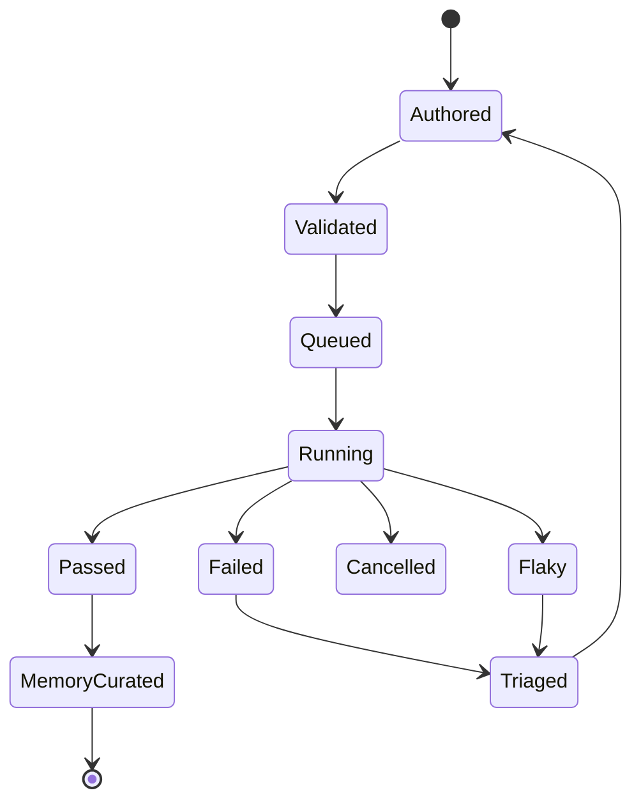

# Product and Business Onboarding

Readiness status: PASS

Journey ID: AQ-J1

## Purpose and business value

AQ-J1 describes the core business operation of `ETUS`: a developer, QA engineer, or coding agent turns reviewable YAML test intent into an executed browser or mobile QA run, then uses artifacts, traces, memory, and dashboard views to decide whether the product under test is healthy.

Evidence label: `verified-from-source`

Primary value:

- Reduce hand-written selector maintenance by letting a planner act from visible UI state.
- Keep QA assets local, reviewable, and version-controlled.
- Improve repeated execution through cache and memory.
- Make failures inspectable enough for humans and agents to triage.

## Trigger and preconditions

Triggers:

- CLI execution via `ETUS run`.
- Dashboard run trigger or queue enqueue.
- MCP run enqueue from a coding agent.

Preconditions:

- A valid `ETUS.config.yaml` exists with workspace paths.
- Test or suite YAML matches configured workspace globs.
- LLM credentials or compatible provider configuration are available.
- The target runtime is available: Playwright browser, Appium mobile session, or device farm.
- Optional services such as cache, memory, hooks, auth-state, dashboard, recording, and accessibility are configured.

## Actors, roles, and responsibilities

| Actor | Responsibility | Evidence label |
| --- | --- | --- |
| Developer or QA engineer | Owns test intent, config, review, run interpretation, and debugging. | inferred-from-source |
| Coding agent | Uses MCP/schema/id tools to author, validate, run, and triage tests. | verified-from-source |
| CLI runtime | Resolves config, variables, models, target, adapter, reporters, and execution mode. | verified-from-source |
| Core agent runtime | Orchestrates test, step, planner, verifier, cache, memory, hooks, screenshots, and results. | verified-from-source |
| Platform adapter | Observes and acts on web, Android, or iOS UI. | verified-from-source |
| Dashboard | Lists, runs, watches, stores, and visualizes QA results. | verified-from-source |
| MCP server | Presents safe local tools for coding-agent authoring and triage. | verified-from-source |

## Ordered business stages

1. Configure the workspace, targets, providers, services, devices, and runtime defaults.
2. Author or select a YAML test or suite.
3. Validate schemas, canonical IDs, targets, and workspace-safe paths.
4. Resolve runtime inputs: LLM, platform, auth-state, variables, secrets, cache, memory, hooks, reporters.
5. Execute the test through the core agent loop.
6. Observe, plan, execute, verify, and retry sub-actions for each natural-language step.
7. Persist run rows, step rows, artifacts, screenshots, logs, token usage, and execution logs.
8. Curate memory and update cache when enabled.
9. Review the run in CLI output, dashboard UI, or MCP triage tools.
10. Decide pass, failure, cancellation, flaky outcome, or next investigation.

## Decisions and business rules

| Rule | Behavior | Evidence label |
| --- | --- | --- |
| Natural-language tests must still be schema-valid. | `TestDefinitionSchema` requires canonical `test-id`, `name`, `target`, and at least one step. | verified-from-source |
| Global platform is not allowed. | Config schema rejects `use.platform` at global level. | verified-from-source |
| Test target owns platform resolution. | Registry target schema carries `platform` and platform-specific app/url fields. | verified-from-source |
| Memory can be disabled per run. | CLI supports `--no-memory`. | verified-from-source |
| Cache can be disabled per run. | CLI supports `--no-cache`. | verified-from-source |
| Dashboard queue serializes mobile by platform. | Mobile jobs are blocked when the same platform is already active. | verified-from-source |
| MCP run tools operate through dashboard API. | MCP tool handlers call dashboard endpoints. | verified-from-source |

## Entity lifecycle and state transitions

Core lifecycle:

Run status values are persisted as `passed`, `failed`, `skipped`, `running`, `cancelled`, `pending`, or `flaky`.

## Happy path

1. A user writes a YAML test with a canonical test ID and natural-language steps.
2. The CLI or dashboard validates and resolves the file.
3. The runtime launches the target platform adapter.
4. The adapter navigates to the target URL or app context.
5. For each step, the adapter observes live UI state.
6. The planner chooses a typed action.
7. The adapter executes the action.
8. The verifier confirms the step objective when needed.
9. The reporter writes run and step data.
10. The dashboard shows the run, screenshots, logs, reasoning, and artifacts.
11. Cache and memory improve future runs when enabled.

## Critical exceptions, failure paths, and recovery

| Exception | Recovery or handling |
| --- | --- |
| YAML parse/schema error | CLI and dashboard validation report precise issues before execution. |
| Missing browser support | CLI formats a browser install retry command. |
| Appium/device setup failure | Mobile setup errors are categorized and reported. |
| Planner chooses a bad action | The loop re-observes and replans until max attempts or timeout. |
| Verifier rejects completion | The verifier reasoning feeds the next planning attempt. |
| Hook failure | Execution log captures hook status, stdout, stderr, variables, and return data. |
| Process exits before reporter completion | Dashboard server marks the run failed and finalizes artifact best-effort. |
| User cancels run | Queue and runner update parent/child runs and artifacts as cancelled. |
| Memory hurts outcomes | Circuit breaker can stop memory injection when fail rate degrades. |

## Outcome and postconditions

Postconditions:

- A run record exists in dashboard SQLite when dashboard reporter or queue is used.
- Step-level results include action, reasoning, screenshots, logs, variables, token usage, and sub-action traces when available.
- Run artifact stores source/config/runtime/memory/error snapshots.
- Cache entries may be updated after verified sub-actions.
- Memory observations may be added, confirmed, deprecated, or deleted.

## Ownership and external dependencies

Owned by this repo:

- YAML schemas and parser.
- Agent runtime loop.
- Platform adapter contracts and implementations.
- Dashboard server/UI.
- MCP tool facade.
- Local filesystem and SQLite storage model.

External dependencies:

- LLM providers and auth plugins.
- Playwright-managed browsers.
- Appium and mobile drivers.
- BrowserStack or other device farm providers.
- Docker for hooks.
- PostHog transport when analytics privacy is not enabled.

## Related capabilities

- Test and suite authoring.
- Config manager.
- Hooks registry and hook workbench.
- Auth credential management.
- Web auth-state capture.
- Device discovery and mobile driver install.
- Run queue and live execution events.
- Memory catalog and product memory reader.
- Insights, token, cost, pass-rate, duration, and breakdown reporting.
- MCP authoring and triage.

## Domain vocabulary

| Term | Meaning |
| --- | --- |
| Test | YAML definition with target and natural-language steps. |
| Suite | YAML list of referenced tests with optional shared target/context/use. |
| Step | Natural-language instruction or structured step object. |
| Sub-action | One planner-selected action inside a step. |
| Adapter | Platform-specific observe/execute/screenshot implementation. |
| Planner | LLM component that chooses typed actions. |
| Verifier | LLM component that confirms step completion. |
| Cache | File-backed store of validated action plans. |
| Memory | File-backed observations injected into future steps. |
| Hook | Docker-sandboxed script for setup, teardown, or inline execution. |
| Run artifact | JSON snapshot of config, source, runtime, memory, and errors. |

## Evidence status and grey zones

| Claim | Evidence label | Source pointer | Confidence |
| ----- | -------------- | -------------- | ---------- |
| CLI identifies product as a self-improving Agentic QA harness with Memory. | verified-from-source | `packages/cli/src/cli.ts` | High |
| Test YAML requires canonical `test-id`, target, name, and steps. | verified-from-source | `packages/core/src/schema/test-schema.ts` | High |
| Core run config owns adapter, planner, verifier, cache, memory, hooks, reporters, and secrets. | verified-from-source | `packages/core/src/agent/runner.ts` | High |
| Step execution follows observe, plan/cache, execute, verify/retry. | verified-from-source | `packages/core/src/agent/loop.ts` | High |
| Dashboard queue persists pending runs and artifacts before execution. | verified-from-source | `packages/dashboard-server/src/queue/job-queue.ts` | High |
| MCP exists to author, validate, run, and triage through local trusted tools. | verified-from-source | `packages/mcp/src/ETUS-server.ts` | High |
| Product intent beyond implemented source and README is not fully confirmed by business stakeholders. | needs-confirmation | Owner: product/business owner | Medium |
