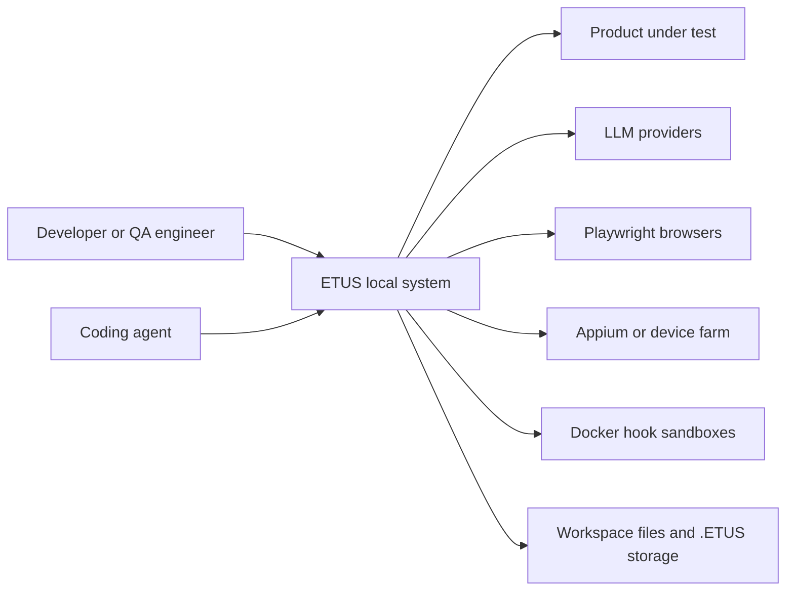
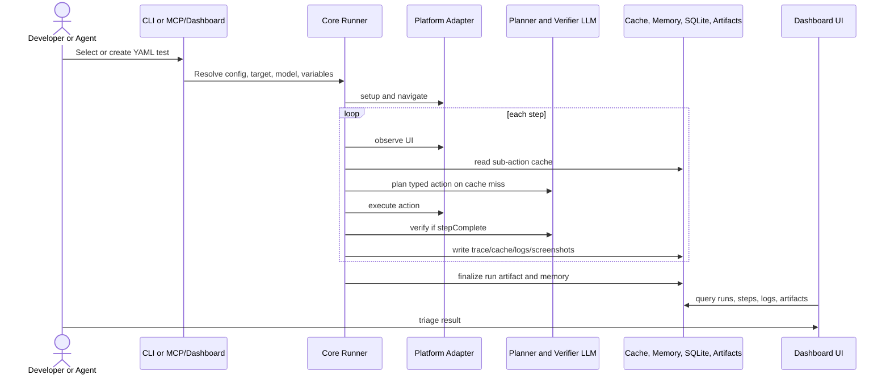
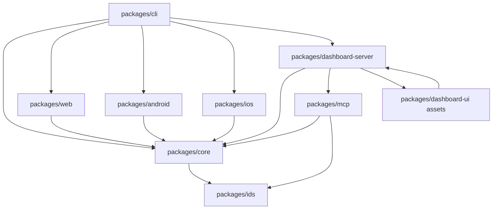

# Technical Architecture Onboarding

Readiness status: PASS

Related Journey ID: AQ-J1

## C1 System Context

`ETUS` is a local-first QA system for authoring, executing, observing, and triaging natural-language tests for web and mobile targets.



Trust boundaries:

- Local workspace boundary: config, tests, suites, hooks, memory, cache, auth-state, and artifacts.
- External execution boundary: browser, mobile device, device farm, and Docker.
- Credential boundary: LLM auth store, secrets file, auth-state payload.
- Agent boundary: MCP tools expose local dashboard/config/test/run capabilities to coding agents.

## C2 Containers

| Container | Responsibility | Technology/runtime | Inputs | Outputs | Owned data | Failure boundary |
| --- | --- | --- | --- | --- | --- | --- |
| CLI package `ETUS` | Command surface, config resolution, run orchestration, install/setup utilities. | Node ESM, Commander | CLI flags, config, YAML files, env, secrets | Console, JUnit, dashboard reporter, artifacts | None durable by itself | Parse/config/provider/runtime failures |
| Core runtime | Schemas, parser, runner, planner/verifier contracts, actions, cache, memory, hooks, auth, analytics. | TypeScript Node package | Test/suite definitions, adapter, LLM model, services | Test results, step traces, cache/memory writes | Cache, memory, artifact payload contracts | Step timeout, planner/verifier errors, hook failure |
| Web adapter | Browser setup, observe, execute, screenshots, console/network capture. | Playwright core | Platform config, actions | ScreenState, ActionResult, screenshots/logs | Browser context state | Browser install/disconnect/action errors |
| Android adapter | Android Appium session and actions. | WebdriverIO/Appium | Device/app/farm config, actions | ScreenState, ActionResult, mobile logs | Appium session | Driver/device/farm errors |
| iOS adapter | iOS Appium session and actions. | WebdriverIO/Appium | Device/app/farm config, actions | ScreenState, ActionResult, mobile logs | Appium session | Driver/device/farm errors |
| Dashboard server | Local HTTP API, static UI, queue, runner process wrapper, live editor, MCP HTTP integration. | Node HTTP, ws, SQLite | API requests, DB, config, workspace | JSON APIs, SSE, WebSocket, static assets | SQLite run DB | Child process, DB, queue, API, static serving failures |
| Dashboard UI | Human run/test/suite/hook/memory/config/insights interface. | React, Vite, React Router | Dashboard API | Interactive UI | Browser UI state | API and client rendering failures |
| MCP server | Local trusted tools for authoring, schema, IDs, run enqueue, triage. | MCP SDK over stdio or local HTTP | MCP tool calls | JSON tool results | None durable directly | Dashboard API/tool validation errors |
| SQLite DB | Runs, steps, logs, reasoning traces, execution logs, token events, artifacts. | better-sqlite3 | Dashboard reporter/server writes | Queryable dashboard data | `.ETUS/runs.db` or configured path | Migration/locking/corruption |
| Hook sandbox | Setup/teardown/inline script isolation. | Docker containers | Hook definitions, env/secrets/auth-state | Variables, stdout/stderr, execution log | Temp workspace only | Docker unavailable, script failure |

## Selective C3 Components

### CLI run orchestration

Entrypoint: `packages/cli/src/commands/run.ts`

Responsibilities:

- Parse run flags and file patterns.
- Resolve config, workspace, target, device/farm, LLM models, auth-state, variables, secrets, reporters, memory, cache, and hooks.
- Build platform config.
- Dispatch tests or suites into core runtime.

Call path evidence:

- CodeGraph found `runTest` as a core function at `packages/core/src/agent/runner.ts:91`.
- CodeGraph found direct callers of `runTest`: `runTestWithRetry` and `runSuite`.

### Core test runner

Entrypoint: `runTest()` in `packages/core/src/agent/runner.ts`.

Responsibilities:

- Initialize variable store from env, inline, suite, CLI, and hook variables.
- Notify reporters.
- Enforce test and step timeouts.
- Navigate to resolved target URL.
- Initialize memory provider.
- Run hooks and inline `runJS`/Appium shortcuts.
- Interpolate variables and secrets.
- Execute each step through `executeStep()`.
- Capture screenshots, accessibility, console/network logs, variables, and memory outcomes.

Failure behavior:

- Test timeout uses abort controllers.
- SIGINT cancels test and active step.
- Memory init failure is non-fatal.
- Hook failure can fail a step.

### Agent step loop

Entrypoint: `executeStep()` in `packages/core/src/agent/loop.ts`.

Responsibilities:

- Capture before screenshot.
- Hash step and screen.
- Observe UI through adapter.
- Compress screenshots for planner when configured.
- Read or invalidate sub-action cache.
- Call planner.
- Validate/normalize actions and resolve secrets.
- Execute adapter action.
- Call verifier when planner marks the step complete.
- Store sub-action traces, token usage, screenshots, annotations, screen contexts.

CodeGraph callees include adapter `observe`, adapter `execute`, `hashStepInstruction`, `getSubAction`, `setSubAction`, planner `plan`, verifier `verify`, `compressScreenshot`, and secret redaction/resolution.

### Dashboard execution control

Entrypoints:

- `startServer()` in `packages/dashboard-server/src/server/server.ts`
- `JobQueue` in `packages/dashboard-server/src/queue/job-queue.ts`
- `TestRunner` in `packages/dashboard-server/src/execution/test-runner.ts`

Responsibilities:

- Serve dashboard UI.
- Create API router.
- Resolve CLI binary.
- Spawn CLI child process for live runs.
- Parse `ETUS_AGENT_EVENT:` stdout messages.
- Maintain pending/running queue.
- Serialize mobile jobs per platform.
- Finalize run artifacts best-effort on abnormal process close.

### MCP facade

Entrypoint: `createAgentQaMcpServer()` in `packages/mcp/src/ETUS-server.ts`.

Responsibilities:

- Register schema, config, ID, test, suite, hook, run, artifact, log, cancel, and failure classification tools.
- Mask config and auth-sensitive values.
- Call local dashboard APIs for authoring and run operations.
- Capture best-effort analytics unless privacy is enabled.

## Primary journey technical sequence



## Module dependency map



## Runtime and startup model

Root tooling:

- Node `>=24`.
- `pnpm@10.6.1`.
- Turbo for repo-level build/test/typecheck/lint.
- `tsup` for Node packages.
- Vite for dashboard UI.
- Vitest for tests.

Startup modes:

- CLI: `ETUS run`.
- Dashboard: `ETUS dashboard` or `ETUS serve`.
- MCP: `ETUS mcp` over stdio, or dashboard-owned local MCP HTTP endpoint.
- Web execution: Playwright launches selected browser.
- Mobile execution: Appium session is created locally or via farm provider.
- Hooks: Docker runtime container is started per hook.

## Primary entrypoints

| Surface | Entrypoint |
| --- | --- |
| CLI root | `packages/cli/src/cli.ts` |
| Run command | `packages/cli/src/commands/run.ts` |
| Config loader | `packages/cli/src/config.ts` |
| Core test runner | `packages/core/src/agent/runner.ts` |
| Core step loop | `packages/core/src/agent/loop.ts` |
| Tool registry | `packages/core/src/tools/actions/index.ts` |
| Web adapter | `packages/web/src/adapter.ts` |
| Android adapter | `packages/android/src/adapter.ts` |
| iOS adapter | `packages/ios/src/adapter.ts` |
| Dashboard server | `packages/dashboard-server/src/server/server.ts` |
| Dashboard routes | `packages/dashboard-server/src/server/routes.ts` |
| Dashboard DB schema | `packages/dashboard-server/src/db/schema.ts` |
| Dashboard UI routes | `packages/dashboard-ui/src/app.tsx` |
| MCP server | `packages/mcp/src/ETUS-server.ts` |

## Configuration ownership

Config schema: `packages/core/src/schema/config-schema.ts`

Top-level config sections:

- `workspace`
- `services`
- `registry`
- `use`
- `plugins`
- `analytics`

Workspace ownership:

- `workspace.testMatch`
- `workspace.suiteMatch`
- `workspace.hooksFile`
- `workspace.agentRules`
- `workspace.envFile`
- `workspace.secretsFile`

Runtime dirs:

- `.ETUS`
- `.ETUS/cache`
- `.ETUS/auth-states`
- `.ETUS/artifacts`
- `.ETUS/runs.db`

## Data, authentication, messaging, and error boundaries

Data:

- File-backed YAML tests, suites, hooks, env, secrets, agent rules.
- SQLite dashboard DB tables: `runs`, `steps`, `reasoning_traces`, `logs`, `execution_logs`, `token_events`, `run_artifacts`.
- File-backed cache and memory.
- Screenshot/video artifacts.

Authentication:

- LLM credentials through auth store and provider plugins.
- Runtime secrets through `workspace.secretsFile`.
- Web auth-state through Playwright storageState payload and metadata.
- Mobile native app state through `use.mobile.appState`.

Messaging:

- CLI stdout/stderr.
- Dashboard REST APIs.
- Server-sent execution events.
- WebSocket live editor sessions.
- MCP tool protocol.
- Child process live events prefixed with `ETUS_AGENT_EVENT:`.

Error boundaries:

- Schema/parser validation.
- Workspace path validation.
- Adapter setup/execute failures.
- Planner/verifier failures.
- Hook sandbox failures.
- Queue cancellation and stale process handling.
- Dashboard DB migration/version compatibility.

## Test strategy and test locations

Test strategy is package-focused Vitest plus validation scripts.

Test locations:

- Core tests under `packages/core/src/**/__tests__`.
- Dashboard server tests under `packages/dashboard-server/src/__tests__` and live-editor tests.
- Dashboard UI tests under `packages/dashboard-ui/src/**/__tests__`.
- CLI command tests under `packages/cli/src/**/__tests__`.
- MCP tests under `packages/mcp/src/__tests__`.
- Release validation tests under `scripts/__tests__`.

## Local run, test, and debug commands

Verified from repo instructions, not executed during onboarding:

```bash
pnpm install
pnpm build
pnpm test
pnpm typecheck
pnpm --filter ETUS test
pnpm --filter @etus/ETUS-core test
pnpm --filter @etus/ETUS-dashboard test
pnpm --filter @etus/ETUS-dashboard-ui test
pnpm --filter @etus/ETUS-mcp test
pnpm run validate:skills
pnpm run validate:publish
```

Verified during onboarding:

```bash
codegraph --version
rtk --version
codegraph init
codegraph index
codegraph status
codegraph query runTest --limit 10
codegraph callers runTest --limit 20
codegraph callees executeStep --limit 30
```

## Source pointers and CodeGraph call paths

| Finding | Evidence |
| --- | --- |
| `runTest` core entrypoint exists. | CodeGraph query `runTest`: `packages/core/src/agent/runner.ts:91` |
| `runTest` is called by retry and suite runners. | CodeGraph callers `runTest`: `runTestWithRetry`, `runSuite` |
| `executeStep` is called by `runTest` and live editor internal execution. | CodeGraph callers `executeStep` |
| `executeStep` depends on observe/execute, planner, verifier, cache, screenshot compression, and secret handling. | CodeGraph callees `executeStep` |
| Dashboard UI run surface uses `fetchRuns`, `fetchActiveExecutions`, and `fetchQueueStatus`. | CodeGraph context query for AQ-J1 |

## Evidence status and grey zones

| Claim | Evidence label | Source pointer | Confidence |
| ----- | -------------- | -------------- | ---------- |
| CodeGraph index is current and available. | verified-from-source | `codegraph status` | High |
| Monorepo package responsibilities match root instructions. | verified-from-source | `AGENTS.md` | High |
| Core runtime owns runner/loop/planner/verifier/cache/memory/hooks contracts. | verified-from-source | `packages/core/src` | High |
| Dashboard server owns queue, DB, routes, live editor, service startup. | verified-from-source | `packages/dashboard-server/src` | High |
| Dashboard UI owns human workflow pages. | verified-from-source | `packages/dashboard-ui/src/app.tsx` | High |
| MCP is a local facade for schema, authoring, run, artifact, logs, cancel, and triage. | verified-from-source | `packages/mcp/src/ETUS-server.ts` | High |
| Local run/test commands were not executed as package verification in this onboarding pass. | needs-confirmation | Owner: engineer running validation | Medium |
